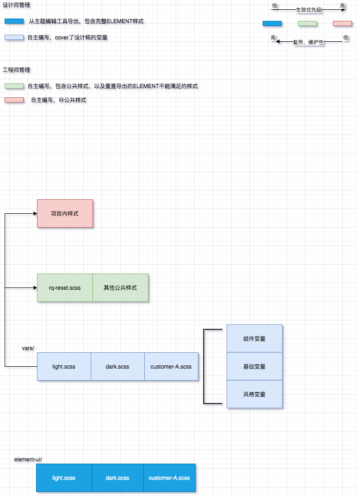

# RQTHEMES

> ricequant common themes

## Release

https://www.npmjs.com/package/@rqjs/rqthemes

## Goal

- unify mutiple products theme, **product projects using variables defined in src/vars(lib/vars)**
- save base scss preprocess time

## Usage

1. import one of element-ui themes or both of them

- element light theme: `import '@rqjs/rqthemes/lib/element-light.css'`
- element dark theme: `import '@rqjs/rqthemes/lib/element-dark.css'`

2. import all vars

- `import '@rqjs/rqthemes/lib/vars.css'`

3. import entry file, which contains global style, element-ui reset and highcharts theme(styled mode)

- `import '@rqjs/rqthemes'`
- please use `import @rqjs/rqthemes/lib/legacy.css` instead if project need support IE
- _postcss IE polyfill could fetch light vars from `@rqjs/rqthemes/lib/light.json`_

## Caveats

- **IE support light theme only**
- **highcharts reqiure v7.0.0+, using styled mode**

## Developer

### Commands

```bash
npm run start : preview element-ui themes,visit http://localhost:1234

npm run build : generating publish files

npm run lint : audit code style

npm run clean : clear demo cache
```

### Contributions

1. color vars in theme files is **maintained by designer**.

2. [`git 规范`](http://wiki.ricequant.com/pages/viewpage.action?pageId=17269198)

3. [`lint 规范`](http://wiki.ricequant.com/pages/viewpage.action?pageId=45875427)

4. [`npm 规范`](http://wiki.ricequant.com/pages/viewpage.action?pageId=52232790)

5. files structure description  
   
